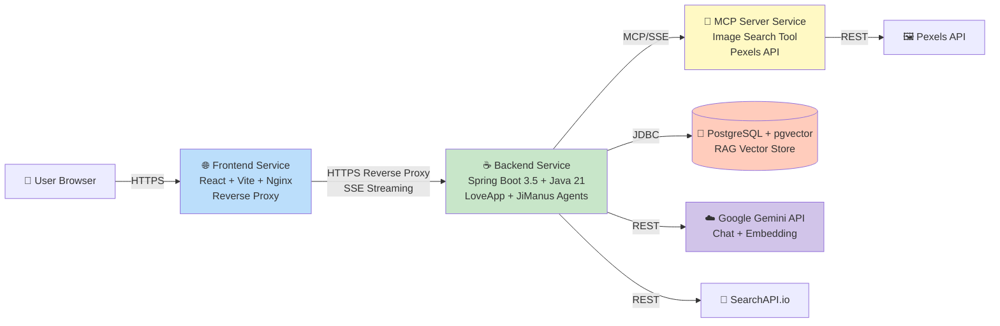
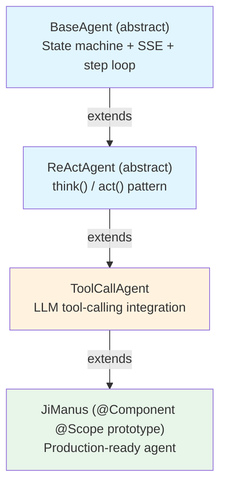
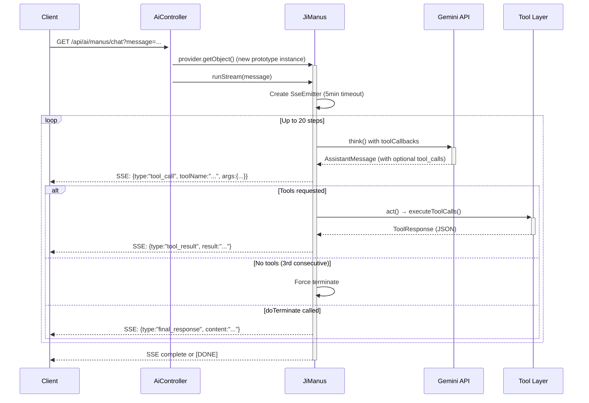

<div align="center">

# 🤖 Ji-AI-Agent

### A Production-Grade Multi-Agent AI System Built with Spring Boot

**Java-first AI agent framework with tool-calling, RAG, MCP, and SSE streaming — deployed on Railway.**

[](https://frontend-production-5bc7.up.railway.app)
[](https://backend-production-bab0.up.railway.app/api/swagger-ui/index.html)

[](https://spring.io/projects/spring-boot)
[](https://www.oracle.com/java/)
[](https://spring.io/projects/spring-ai)
[](https://ai.google.dev/)
[](https://github.com/pgvector/pgvector)
[](https://railway.app)
[](LICENSE)

</div>

---

## ✨ Try It Live

🌐 **Live URL**: **https://frontend-production-5bc7.up.railway.app**

Just open the link and chat — no signup required. Try these prompts:

| What to Try | What Happens |
|---|---|
| `"hello"` (English) | AI responds in English with relationship advice |
| `"你好"` (Chinese) | AI responds in Chinese — language auto-detected |
| `"帮我搜一张约会的照片"` | Calls **MCP image search tool** → renders 3+ Pexels images inline |
| `"请说一句爱情谚语并生成 PDF"` | Calls **PDF tool** → returns clickable download link |
| Switch to **Manus** tab → `"搜索渥太华 5 公里内的景点并制作游玩计划 PDF"` | Multi-step agent: web search → scrape → PDF → download |

---
## ⚡ Tech Stack

| Layer | Technology |
|---|---|
| **Backend Runtime** | Java 21, Spring Boot 3.5.13 |
| **AI Framework** | Spring AI 1.1.4 |
| **LLM** | Google Gemini 2.5 Flash Lite (via Gemini Developer API) |
| **Embedding** | `gemini-embedding-001` (768-dim with Matryoshka truncation) |
| **Vector Store** | PostgreSQL 15 + pgvector (HNSW index, COSINE distance) |
| **MCP** | `spring-ai-starter-mcp-client` + `spring-ai-starter-mcp-server-webmvc` |
| **PDF** | iText 9.0 with embedded NotoSansCJK font |
| **HTTP Parsing** | Jsoup 1.21 |
| **API Docs** | Knife4j (Swagger 3) |
| **Frontend** | React 18 + TypeScript + Vite + TailwindCSS + react-markdown |
| **Reverse Proxy** | Nginx 1.27 with envsubst-templated configuration |
| **Containerization** | Multi-stage Docker builds (Maven + JRE) |
| **Deployment** | Railway (4 services with private networking) |

---

## 🏗️ Engineering Highlights

### 1. Prompt as Configuration (12-Factor Compliant)

All system prompts are externalized via environment variables. Change AI personality on Railway without rebuilding:

```yaml
app:
  prompts:
    love-app:
      system: ${PROMPT_LOVE_APP:You are an expert in relationship psychology...}
    manus:
      system: ${PROMPT_MANUS_SYSTEM:You are JiManus, an autonomous AI agent...}
```

### 2. Prototype-Scoped Agent Beans

Agents have **per-request state** (`messageList`, `currentStep`, `sseEmitter`). Single-scoped beans would corrupt data when concurrent users hit the API.

```java
@Component
@Scope(ConfigurableBeanFactory.SCOPE_PROTOTYPE)
public class JiManus extends ToolCallAgent { ... }

// Controller
@Resource
private ObjectProvider<JiManus> jiManusProvider;  // Lookup pattern

@GetMapping("/manus/chat")
public SseEmitter doChatWithManus(String message) {
    return jiManusProvider.getObject().runStream(message);  // Fresh instance per request
}
```

### 3. Nginx SSE-Aware Reverse Proxy

SSE streams require special Nginx config to bypass buffering:

```nginx
location /api/ {
    set $backend ${BACKEND_INTERNAL_URL};
    proxy_pass $backend;

    proxy_buffering off;          # Critical for SSE
    proxy_cache off;
    proxy_read_timeout 3600s;     # Long-lived connections
    chunked_transfer_encoding off;
}
```

### 4. MCP Microservice Pattern

Image search lives in a **separate Spring Boot module** (`ji-image-search-mcp-server`), connected via MCP protocol. This demonstrates clean service decomposition — tools are independently deployable, scalable, and replaceable.

### 5. Smart Tool Use via Prompt Engineering

Carefully crafted prompts ensure the LLM:
- Calls `searchImage` and renders results as `` markdown (not just describing them in text)
- Calls `generatePDF` and returns `[点击下载](path)` clickable links
- Doesn't get stuck asking clarifying questions when the user explicitly requests an action

---
## 🎯 What Makes This Project Stand Out

This isn't a "hello world" tutorial project. It's a **production-deployed**, **multi-service** AI system showcasing real engineering choices:

- 🏗️ **Multi-Agent Architecture** — Two distinct agents (LoveApp + JiManus) built on a 4-level abstract class hierarchy demonstrating the **ReAct pattern**
- 🛠️ **8 Built-in Tools + MCP Integration** — Tool-calling agents that actually do things: search the web, scrape pages, generate PDFs, download files, execute shell commands
- 🔌 **Model Context Protocol (MCP)** — Independent MCP server (image search) deployed as a separate microservice, demonstrating standardized AI tool extension
- 📚 **RAG with Query Rewriting** — `RewriteQueryTransformer` improves retrieval quality via PostgreSQL + pgvector (768-dim embeddings)
- 🌐 **Full Internationalization** — Migrated from Alibaba DashScope to Google Gemini API; AI auto-detects user language and responds accordingly
- ⚙️ **12-Factor Configuration** — All prompts externalized via environment variables; can hot-update AI behavior without redeploying
- 🚀 **Production Deployment** — 4-service architecture deployed on Railway: backend + MCP server + frontend (Nginx) + PostgreSQL + pgvector
- 🔄 **SSE Streaming** — Real-time token-by-token output with proper proxy buffering bypass for Nginx reverse proxy

---

## 📐 System Architecture



All services are deployed independently on Railway and communicate via internal/public networking.

---

## 🧠 Two Agents, Two Patterns

### 🩷 LoveApp — Conversational Expert

A relationship counseling AI built directly on Spring AI's `ChatClient`:
- Maintains multi-turn memory via `MessageWindowChatMemory` (sliding window of 20 messages)
- Auto-detects user language (Chinese ↔ English)
- Has access to **all 8 tools** (PDF generation, image search via MCP, web search, etc.)
- Streams responses token-by-token via SSE

### 🦾 JiManus — Autonomous ReAct Agent

A general-purpose autonomous agent that **plans and executes complex multi-step tasks**:
- Built on a 4-level abstract class hierarchy: `BaseAgent` → `ReActAgent` → `ToolCallAgent` → `JiManus`
- Uses the **ReAct pattern**: Think → Act → Observe → Repeat (max 20 steps)
- Streams every intermediate step (`thinking`, `tool_call`, `tool_result`) to the frontend via SSE
- Spring `@Scope("prototype")` + `ObjectProvider` for **per-request isolation** (no state leakage between concurrent users)
- Smart termination: explicit `doTerminate` tool, 3-step no-tool fallback, or 20-step cap

#### Class Hierarchy



#### JiManus Lifecycle



---

## 🛠️ Built-in Tools

All tools are auto-registered via `ToolRegistration.java` and available to both agents.

| Tool | Description | Real Use Case |
|---|---|---|
| 🖼️ **searchImage** (MCP) | Fetch image URLs from Pexels via MCP protocol | "Show me romantic dinner ideas" → returns 3+ inline images |
| 🌐 **searchWeb** | Real-time Google search via SearchAPI.io | "What's the latest Java release?" |
| 📄 **scrapeWebPage** | Extract page content with Jsoup (max 5KB) | Follow-up after `searchWeb` for full content |
| 📥 **downloadResource** | Download any URL to disk | Save an image/document |
| 📝 **readFile / writeFile** | File I/O operations | Save and reload conversation context |
| 💻 **executeTerminalCommand** | Cross-platform shell execution | Run scripts, compile code |
| 📑 **generatePDF** | iText 9.0 + NotoSansCJK font for proper Chinese rendering | Generate downloadable reports |
| 🛑 **doTerminate** | Explicit task completion signal | Called by LLM when task is done |

All tools return standardized `ToolResponse`:
```json
{ "status": "success", "message": "...", "data": ... }
```

---

## 🚀 Quick Start (Local Development)

### Prerequisites

- JDK 21 + Maven 3.9+
- PostgreSQL 15+ with `pgvector` extension
- A Google AI Studio API Key ([free tier here](https://aistudio.google.com/apikey))
- A Pexels API Key (for image search) — [free tier](https://www.pexels.com/api/)
- Node.js 20+ (for frontend dev)

### 1. Configure Environment

```bash
export GEMINI_API_KEY="your-gemini-key"
export PEXELS_API_KEY="your-pexels-key"
export SPRING_DATASOURCE_URL="jdbc:postgresql://localhost:5432/ai_project"
export SPRING_DATASOURCE_USERNAME="postgres"
export SPRING_DATASOURCE_PASSWORD="your-password"
```

### 2. Setup Database

```sql
CREATE DATABASE ai_project;
\c ai_project
CREATE EXTENSION IF NOT EXISTS vector;
```

### 3. Run Services (3 terminals)

```bash
# Terminal 1 — MCP Image Search Server (port 8127)
cd ji-image-search-mcp-server
mvn spring-boot:run

# Terminal 2 — Main Backend (port 8123)
cd ..
mvn spring-boot:run

# Terminal 3 — Frontend Dev Server (port 3001)
cd ji-ai-agent-frontend/frontend
npm install
npm run dev
```

Open http://localhost:3001 and start chatting!

---

## 🚢 Deployment to Railway

The entire system is designed for [Railway](https://railway.app) deployment:

```
Railway Project
├── 🐘 PostgreSQL  (with pgvector pre-installed)
├── ☕ backend       (Dockerfile.backend, port 8080)
├── 🔌 mcp-server   (ji-image-search-mcp-server/Dockerfile, port 8080)
└── 🌐 frontend    (Dockerfile, Nginx + React build, port 8080)
```

Each service has its own `Dockerfile` and `.dockerignore`. Communication uses Railway's **internal networking** (`*.railway.internal`) for backend-to-MCP, and **public HTTPS** for frontend-to-backend reverse proxy.

Required Railway environment variables:

| Service | Variables |
|---|---|
| `backend` | `GEMINI_API_KEY`, `PEXELS_API_KEY`, `SPRING_DATASOURCE_URL`, `SPRING_DATASOURCE_USERNAME`, `SPRING_DATASOURCE_PASSWORD`, `MCP_IMAGE_SEARCH_URL`, `GEMINI_CHAT_MODEL`, `GEMINI_EMBEDDING_MODEL` |
| `mcp-server` | `PEXELS_API_KEY` |
| `frontend` | `BACKEND_INTERNAL_URL`, `PORT` |

---

## 📡 API Reference

| Endpoint | Method | Description |
|---|---|---|
| `/api/ai/love_app/chat/sse` | GET | LoveApp SSE streaming chat |
| `/api/ai/love_app/chat/sync` | GET | LoveApp synchronous chat |
| `/api/ai/manus/chat` | GET | JiManus autonomous agent (SSE) |
| `/api/files/pdf/{filename}` | GET | Download generated PDF |
| `/api/files/download/{type}/{filename}` | GET | Download generated files |
| `/api/swagger-ui/index.html` | GET | Interactive API documentation |

Query params: `?message=<text>&chatId=<uuid>`

---

## 📁 Project Structure

```
ji-ai-agent/
├── 📄 Dockerfile                      # Frontend Dockerfile (root for Railway build context)
├── 📄 Dockerfile.backend              # Main backend (Spring Boot)
├── 📄 nginx.conf.template             # Nginx config with envsubst variables
├── 📄 pom.xml                         # Backend dependencies (Spring AI 1.1.4)
│
├── 📁 src/main/java/com/xiaohang/jiaiagent/
│   ├── 🚀 JiAiAgentApplication.java
│   ├── 📁 agent/
│   │   ├── BaseAgent.java             # Abstract: state, SSE, step-loop
│   │   ├── ReActAgent.java            # Abstract: think/act pattern
│   │   ├── ToolCallAgent.java         # LLM tool-calling integration
│   │   └── JiManus.java               # Production agent (@Scope prototype)
│   ├── 📁 app/
│   │   └── LoveApp.java               # Conversational AI (6 chat methods)
│   ├── 📁 controller/
│   │   ├── AiController.java          # REST + SSE endpoints
│   │   └── FileDownloadController.java # PDF / file downloads
│   ├── 📁 tools/                      # 8 built-in tools
│   ├── 📁 rag/
│   │   ├── QueryRewriter.java         # RewriteQueryTransformer
│   │   ├── LoveAppVectorStoreConfig.java
│   │   └── PgVectorVectorStoreConfig.java
│   └── 📁 advisor/
│       └── MyLoggerAdvisor.java       # Request/response logging
│
├── 📁 src/main/resources/
│   ├── application.yml                # All config externalized via env vars
│   ├── document/                      # RAG knowledge base (Markdown)
│   └── fonts/NotoSansCJKsc-Regular.otf
│
├── 📁 ji-image-search-mcp-server/     # Independent MCP microservice
│   ├── Dockerfile
│   ├── pom.xml
│   └── src/main/java/.../tools/
│       └── ImageSearchTool.java       # Pexels API wrapper
│
└── 📁 ji-ai-agent-frontend/frontend/  # React + Vite frontend
    ├── src/
    │   ├── components/Markdown.tsx    # react-markdown for AI output rendering
    │   ├── hooks/useSSE.ts            # SSE consumption
    │   └── services/                   # API clients
    └── package.json
```

---

## 🌍 What I Learned Building This

This project was a deep dive into:

- **Spring AI's evolving API surface** — migrated through Spring AI 1.0 → 1.1 with breaking changes (`QuestionAnswerAdvisor.builder()`, `TokenTextSplitter.builder()`)
- **AI vendor migration** — refactored from Alibaba DashScope to Google Gemini, including embedding model dimension differences (`text-embedding-005` 768-dim Vertex vs `gemini-embedding-001` 3072-dim with Matryoshka truncation to 768)
- **MCP protocol internals** — debugged async client-server connection timing and SSE transport configuration
- **Production deployment realities** — Railway's IPv6-only internal DNS, Nginx envsubst template processing, multi-stage Docker builds, BuildKit context cancellation
- **Concurrent agent state isolation** — discovered why singleton-scoped agents corrupt under concurrent load
- **Free tier constraints** — Gemini's 20 RPD free tier hits hard for multi-step agents; upgraded to Tier 1 (pay-as-you-go) for stability

---

## 📜 License

MIT — See [LICENSE](LICENSE)

---

<div align="center">

**Built with ☕ and 🤖**

🌐 **[Try the Live Demo](https://frontend-production-5bc7.up.railway.app)** 🌐

</div>
