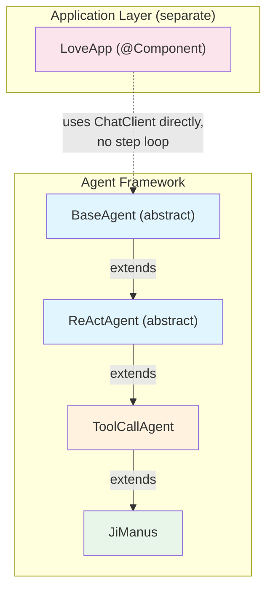
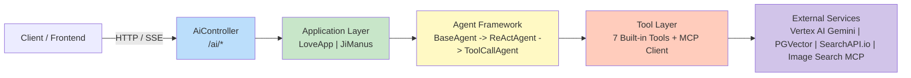
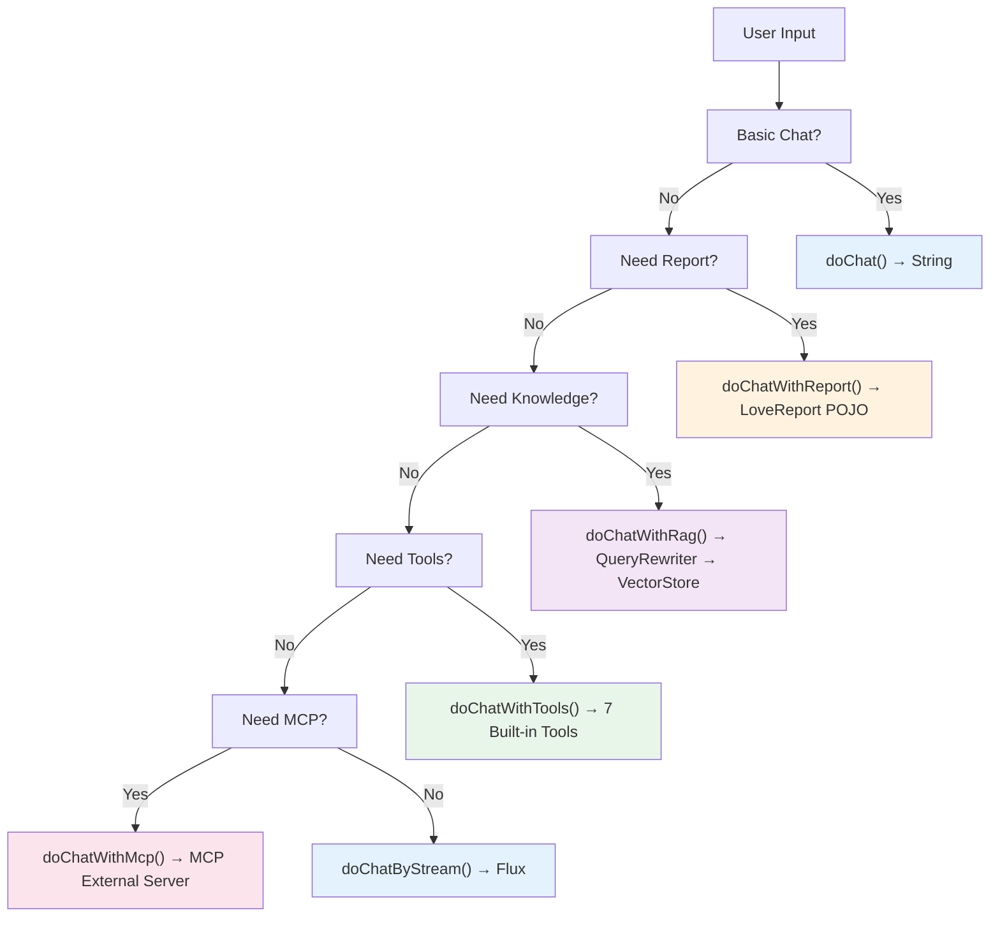

# Ji-AI-Agent

[](https://spring.io/projects/spring-boot)
[](https://www.oracle.com/java/)
[](https://spring.io/projects/spring-ai)
[](LICENSE)

A production-ready Java/Spring Boot AI Agent framework. Ji-AI-Agent combines Google Vertex AI Gemini 2.5 Flash Lite with tool-calling, RAG (Retrieval-Augmented Generation), and MCP (Model Context Protocol) to build autonomous AI agents that can reason, plan, and act. It ships with a complete demo application and is designed for real-world deployment — not a toy demo.

---

## Table of Contents

- [Features](#features)
- [Architecture](#architecture)
- [LoveApp vs JiManus](#loveapp-vs-jimanus)
- [Built-in Tools](#built-in-tools)
- [Quick Start](#quick-start)
- [API Reference](#api-reference)
- [MCP Integration](#mcp-integration)
- [Project Structure](#project-structure)

---

## Features

- **ReAct Pattern** — Agents think before acting. Each step the LLM decides whether to call a tool or respond directly.
- **Tool-Calling Agent** — JiManus can use 7 built-in tools (file, search, scrape, download, terminal, PDF, terminate) to solve complex tasks autonomously.
- **RAG Ready** — Built-in vector store support (SimpleVectorStore in-memory or PostgreSQL + PGVector) with query rewriting via `RewriteQueryTransformer`.
- **MCP Support** — Integrates with external MCP (Model Context Protocol) servers for standardized tool extension.
- **SSE Streaming** — Real-time token-by-token and event-by-event streaming via SseEmitter.
- **Complete Demo** — `LoveApp` demonstrates every capability: basic chat, structured output, RAG, tools, and MCP.
- **Java-first** — Built entirely in Java with Spring Boot. No Python, no LangChain dependency.

---

## Architecture

### Class Inheritance Hierarchy

Ji-AI-Agent follows a 4-level abstract class inheritance chain for the agent framework:



#### BaseAgent (abstract)

The root abstract class. Manages:

- **Agent state**: `IDLE` → `RUNNING` → `FINISHED` / `ERROR`
- **SSE streaming**: `runStream()` creates an `SseEmitter` with 5-minute timeout, sends events asynchronously via `CompletableFuture`
- **Message history**: `List<Message>` (messageList) for conversation context
- **Step-loop execution**: `run()` loops from step 1 to `maxSteps` calling `step()`; `runStream()` uses a for-loop with `sseClosed` flag guard
- **SSE event sending**: `sendSSE(jsonMessage)`, `sendFinalResponseAndStop(content)` which marks the SSE as closed and throws `IllegalStateException` to break the loop
- **Cleanup hook**: `cleanup()` called in `finally` block

Subclasses must implement `step()`.

#### ReActAgent (abstract)

Implements the ReAct (Reasoning + Acting) pattern:

- `think()` — abstract method, returns `boolean` (whether to act)
- `act()` — abstract method, returns `String` (action result)
- `step()` calls `think()` first; if `shouldAct=true`, then calls `act()`
- If `think()` sets state to `FINISHED`, `step()` skips sending a duplicate `final_response`
- If SSE connection closes, `IllegalStateException` propagates up to break the loop

#### ToolCallAgent

Handles LLM tool-calling:

- Receives `ToolCallback[] availableTools` in the constructor
- `think()` calls the LLM with `toolCallbacks` enabled, parses tool calls from the `AssistantMessage`
- Sends `{ "type": "tool_call" }` events via SSE for each tool the LLM decides to use
- `act()` calls `ToolCallingManager.executeToolCalls()` to execute the tools
- Sends `{ "type": "tool_result" }` events via SSE for each tool's return value
- Tracks `noToolCallCount` — 3 consecutive non-tool steps triggers forced termination
- Records `lastThinkingText` for final response fallback
- `generateFinalSummary()` makes an extra LLM call to produce a user-friendly summary when the task ends without thinking text
- Sets `internalToolExecutionEnabled(false)` to disable Spring AI's built-in tool execution, managing the loop manually

#### JiManus

A ready-to-use general-purpose super agent:

- Max 20 steps per task (`setMaxSteps(20)`)
- All 7 built-in tools available at all times
- Only SSE streaming output (`runStream()` method)
- System prompt: acts as an all-capable AI assistant that breaks tasks into steps and calls `doTerminate` when done
- Next step prompt: decides whether to continue or call `doTerminate`
- Terminates via: `doTerminate` tool, 3x no-tool calls, max steps, or LLM stops calling tools
- If `doTerminate` is called: uses `lastThinkingText` as final response; otherwise calls `generateFinalSummary()`

#### LoveApp

**Not part of the agent inheritance chain.** A separate `@Component` that uses Spring AI `ChatClient` directly:

- Uses `MessageWindowChatMemory` (max 20 messages) with `MessageChatMemoryAdvisor` for multi-turn conversation via `chatId`
- Acts as a love psychology expert via `SYSTEM_PROMPT`
- Has 6 distinct chat methods covering basic chat, structured output, RAG, tools, and MCP
- Does **not** use the `BaseAgent` step-loop — it is a higher-level app built on top of Spring AI

### System Architecture



---

## LoveApp vs JiManus

Both are `@Component` beans, but they serve very different purposes.

### Side-by-Side Comparison

| Aspect | LoveApp | JiManus |
|--------|---------|---------|
| Class type | `@Component` (app-layer) | `@Component extends ToolCallAgent` (framework-layer) |
| Role | Love counseling expert | General-purpose AI assistant |
| Memory | `MessageWindowChatMemory` (20 msgs) | `List<Message>` in `BaseAgent` |
| Multi-turn | Yes (via `chatId`) | Yes (via `messageList`) |
| Basic chat | `doChat`, `doChatByStream` | No |
| Structured output | `doChatWithReport` → `LoveReport` POJO | No |
| RAG | `doChatWithRag` | No |
| Tool calling | `doChatWithTools` | Always available |
| MCP | `doChatWithMcp` | No |
| SSE streaming | Partial (basic chat only) | Full (all event types) |
| Max steps | N/A (single/multi-turn) | 20 steps |
| Termination logic | N/A | 4 conditions |

### LoveApp — 6 Chat Methods

```
Method 1: doChat(message, chatId) -> String
  Basic multi-turn chat. Uses MessageChatMemoryAdvisor with chatId.
  No tools, no RAG. Returns a single String response.

Method 2: doChatByStream(message, chatId) -> Flux<String>
  SSE streaming basic chat. Returns Flux<String> for real-time
  token-by-token output. Same memory and role as doChat.

Method 3: doChatWithReport(message, chatId) -> LoveReport
  Structured output using .entity(LoveReport.class) to get a
  typed POJO instead of raw text. Returns a LoveReport record:
  record LoveReport(String title, List<String> suggestions) {}

Method 4: doChatWithRag(message, chatId) -> String
  RAG-enhanced chat. First calls QueryRewriter.doQueryRewrite(message)
  which uses RewriteQueryTransformer (Spring AI) to rewrite the user
  query into a more retrieval-friendly form. Then searches
  loveAppVectorStore via QuestionAnswerAdvisor. Supports SimpleVectorStore
  (in-memory) and pgVectorVectorStore (PostgreSQL + PGVector).
  Embedding model: text-embedding-005. Returns a String answer.

Method 5: doChatWithTools(message, chatId) -> String
  Enables all 7 built-in tools via .toolCallbacks(allTools).
  The LLM decides which tools to call. Returns a String.

Method 6: doChatWithMcp(message, chatId) -> String
  Enables MCP client via .toolCallbacks(toolCallbackProvider).
  The LLM can call external MCP services (e.g., the
  ji-image-search-mcp-server submodule). Returns a String.
```

### LoveApp — RAG Knowledge Base

- **Location**: `src/main/resources/document/` — 3 Markdown files covering Single Life Q&A, Dating Q&A, Married Life Q&A
- **Query Rewriting**: `QueryRewriter` uses `RewriteQueryTransformer` (Spring AI) to transform the user's query before vector search
- **Vector Store**: `loveAppVectorStore` (SimpleVectorStore, 768 dimensions, COSINE distance). Can switch to `pgVectorVectorStore` (PGVector) via configuration
- **Embedding Model**: Vertex AI `text-embedding-005`

### JiManus — SSE Event Lifecycle

```mermaid
sequenceDiagram
    participant Client
    participant AiController
    participant BaseAgent
    participant ReActAgent
    participant ToolCallAgent
    participant ToolCallingManager

    Client->>+AiController: GET /api/manus/chat?message=...
    AiController->>+BaseAgent: new JiManus(allTools, chatModel)
    AiController->>BaseAgent: runStream(message)
    BaseAgent->>BaseAgent: create SseEmitter (5min timeout)
    BaseAgent->>BaseAgent: CompletableFuture runs step loop

    loop For each step (max 20)
        BaseAgent->>+ReActAgent: step()
        ReActAgent->>+ToolCallAgent: think()
        ToolCallAgent->>ToolCallAgent: LLM call with toolCallbacks
        ToolCallAgent-->>Client: SSE: {"type":"tool_call", "toolName":"...", "args":{...}}

        alt no tool calls, step == 1
            ToolCallAgent-->>Client: SSE: {"type":"final_response"}
        else tool calls exist
            ReActAgent->>ToolCallAgent: act()
            ToolCallAgent->>+ToolCallingManager: executeToolCalls()
            ToolCallingManager-->>-ToolCallAgent: tool result
            ToolCallAgent-->>Client: SSE: {"type":"tool_result", "toolName":"...", "result":"..."}
        else no tool calls, step > 1
            ToolCallAgent: increment noToolCallCount
            alt noToolCallCount >= 3
                ToolCallAgent-->>Client: SSE: {"type":"final_response"}
            else doTerminate called
                ToolCallAgent-->>Client: SSE: {"type":"final_response"}
                ToolCallAgent-->>Client: [DONE]
        end
    end

    BaseAgent-->>-Client: SseEmitter completes or times out
```

All SSE events are JSON strings with a `type` field:

```json
{ "type": "thinking",       "content": "..." }
{ "type": "tool_call",      "toolName": "...", "args": { ... } }
{ "type": "tool_result",    "toolName": "...", "result": "..." }
{ "type": "final_response", "content": "..." }
{ "type": "error",          "error": "..." }
```

### JiManus — Termination Logic

JiManus stops when **any** of these conditions are met:

1. The AI calls the `doTerminate` tool → state set to `FINISHED`, `lastThinkingText` sent as `final_response`
2. No thinking text produced → calls `generateFinalSummary()` (extra LLM call) for a user-friendly summary
3. 3 consecutive steps where the AI calls no tools → forced termination
4. Max 20 steps reached → `FINISHED` state, error message sent via SSE

### LoveApp — Chat Mode Selection



---

## Built-in Tools

All 7 tools are registered in `ToolRegistration.java` and passed to `JiManus` as `ToolCallback[]`:

| Tool | Method | Description |
|------|--------|-------------|
| **FileOperationTool** | `readFile(fileName)` / `writeFile(fileName, content)` | Read from and write to local files. Use when the user wants to save data or read saved files. |
| **WebSearchTool** | `searchWeb(query)` | Real-time Google search via SearchAPI.io. Use when the user asks about current information, news, or facts. |
| **WebScrapingTool** | `scrapeWebPage(url)` | Parse and extract content from web pages using Jsoup (max 5000 chars). Use after WebSearchTool to get page details. |
| **ResourceDownloadTool** | `downloadResource(url, fileName)` | Download files from URLs to disk. Use when the user wants to save an image, document, or any URL resource. |
| **TerminalOperationTool** | `executeTerminalCommand(command)` | Execute Windows/macOS/Linux shell commands. Use when the user wants to run scripts, compile code, or execute system commands. |
| **PDFGenerationTool** | `generatePDF(fileName, content)` | Generate PDF documents with CJK (Chinese) font support using iText 9.0.0 and NotoSansCJKsc. Use when the user wants a PDF report or document. |
| **TerminateTool** | `doTerminate()` | Explicitly end the agent task. Called by the LLM when all steps are complete. |

All tool responses return JSON strings wrapped by `ToolResponse`:

```json
{ "status": "success", "message": "...", "data": ... }
{ "status": "error",   "message": "..." }
```

---

## Quick Start

### Prerequisites

- **JDK 21**
- **Maven 3.9+**
- **PostgreSQL 15+** with the `pgvector` extension enabled
- **Google Vertex AI** credentials configured (service account key)

### Environment Variables

```bash
export SEARCH_API_KEY="your-searchapi-io-key"
export MCP_IMAGE_SEARCH_URL="http://localhost:8127"   # optional, default
export GOOGLE_APPLICATION_CREDENTIALS="/path/to/service-account-key.json"
```

### Database Setup

```sql
CREATE EXTENSION IF NOT EXISTS vector;
CREATE DATABASE ai_project;
```

### Configuration

Key settings in `application.yml`:

```yaml
server:
  port: 8123
  servlet:
    context-path: /api

spring:
  ai:
    vertex:
      ai:
        gemini:
          chat:
            options:
              model: gemini-2.5-flash-lite
        embedding:
          text:
            options:
              model: text-embedding-005
  vectorstore:
    pgvector:
      index-type: HNSW
      dimensions: 768
      distance-type: COSINE_DISTANCE
      initialize-schema: true
  datasource:
    url: jdbc:postgresql://localhost:5432/ai_project

search:
  api-key: ${SEARCH_API_KEY}
```

### Build & Run

```bash
# Build
mvn clean package -DskipTests

# Run
java -jar target/ji-ai-agent-0.0.1-SNAPSHOT.jar

# API Documentation
open http://localhost:8123/api/swagger-ui.html
```

---

## API Reference

| Endpoint | Method | Description |
|----------|--------|-------------|
| `/api/ai/love_app/chat/sync` | GET | Synchronous LoveApp chat. Returns a plain String response. |
| `/api/ai/love_app/chat/sse` | GET | SSE streaming via `Flux<String>` (Spring's reactive stream). Produces `text/event-stream`. |
| `/api/ai/love_app/chat/server_sent_event` | GET | SSE via Spring's `ServerSentEvent` wrapper. Same as above but with event metadata. |
| `/api/ai/love_app/chat/sse_emitter` | GET | SSE via `SseEmitter` with 3-minute timeout. Subscribe pattern for server-push. |
| `/api/ai/manus/chat` | GET | JiManus agent — SSE via `SseEmitter` with 5-minute timeout. Parameters: `message`. |
| `/api/swagger-ui.html` | GET | Knife4j API documentation (Swagger UI). |

### LoveApp Query Parameters

```
?message=What%20is%20your%20advice%3F&chatId=user123
```

### JiManus Query Parameters

```
?message=Search%20for%20the%20latest%20Java%20news%20and%20save%20a%20PDF%20report
```

---

## MCP Integration

`ji-image-search-mcp-server` is a **separate Spring Boot submodule** that exposes an `ImageSearchTool` via the MCP (Model Context Protocol) on port **8127**.

- It uses `MethodToolCallbackProvider` to expose the tool
- LoveApp can call it via `doChatWithMcp(message, chatId)`
- The MCP client in `application.yml` connects via SSE:

```yaml
spring:
  ai:
    vertex:
      mcp:
        client:
          sse:
            connections:
              server1:
                url: ${MCP_IMAGE_SEARCH_URL:http://localhost:8127}
```

To run the MCP server independently:

```bash
cd ji-image-search-mcp-server
mvn clean package -DskipTests
java -jar target/ji-image-search-mcp-server-*.jar
```

---

## Project Structure

```
ji-ai-agent/
├── pom.xml
├── README.md
├── src/main/
│   ├── java/com/xiaohang/jiaiagent/
│   │   ├── JiAiAgentApplication.java
│   │   ├── agent/                          # Agent framework
│   │   │   ├── BaseAgent.java              # Abstract root — state, SSE, step loop
│   │   │   ├── ReActAgent.java             # Abstract — think/act pattern
│   │   │   ├── ToolCallAgent.java          # Tool-calling implementation
│   │   │   ├── JiManus.java                # Ready-to-use super agent
│   │   │   └── model/
│   │   │       ├── AgentState.java         # IDLE / RUNNING / FINISHED / ERROR
│   │   │       └── AgentSSEMessage.java    # SSE JSON event builders
│   │   ├── app/                            # Application-layer agents
│   │   │   └── LoveApp.java               # Love counseling expert (6 chat methods)
│   │   ├── controller/
│   │   │   └── AiController.java           # REST endpoints for LoveApp and JiManus
│   │   ├── tools/                          # Built-in tools
│   │   │   ├── ToolRegistration.java      # Centralized ToolCallback[] bean
│   │   │   ├── ToolResponse.java          # JSON response wrapper
│   │   │   ├── FileOperationTool.java
│   │   │   ├── WebSearchTool.java
│   │   │   ├── WebScrapingTool.java
│   │   │   ├── ResourceDownloadTool.java
│   │   │   ├── TerminalOperationTool.java
│   │   │   ├── PDFGenerationTool.java
│   │   │   └── TerminateTool.java
│   │   ├── rag/
│   │   │   └── QueryRewriter.java          # RewriteQueryTransformer wrapper
│   │   ├── advisor/
│   │   │   └── MyLoggerAdvisor.java        # Request/response logging advisor
│   │   └── constant/
│   │       └── FileConstant.java           # Shared file path constants
│   └── resources/
│       ├── application.yml
│       ├── fonts/
│       │   └── NotoSansCJKsc-Regular.otf   # CJK font for PDF generation
│       └── document/                        # RAG knowledge base
│           ├── 单身问答.md
│           ├── 恋爱问答.md
│           └── 已婚问答.md
│
└── ji-image-search-mcp-server/              # Submodule: MCP image search server
    ├── pom.xml
    └── src/main/java/com/xiaohang/jiimagesearchmcpserver/
        ├── JiImageSearchMcpServerApplication.java
        └── tools/
            └── ImageSearchTool.java
```

---

## Tech Stack

| Component | Technology |
|-----------|------------|
| Framework | Spring Boot 3.5.13 |
| Language | Java 21 |
| AI | Spring AI 1.0.4, Vertex AI Gemini 2.5 Flash Lite |
| Embedding | Vertex AI text-embedding-005 |
| Vector Store | SimpleVectorStore (in-memory) / PGVector (PostgreSQL) |
| PDF | iText 9.0.0 |
| HTTP Parsing | Jsoup 1.21.2 |
| Utilities | Hutool 5.8.44, Lombok |
| API Docs | Knife4j (Swagger) |
| Protocol | SSE (Server-Sent Events), MCP (Model Context Protocol) |
